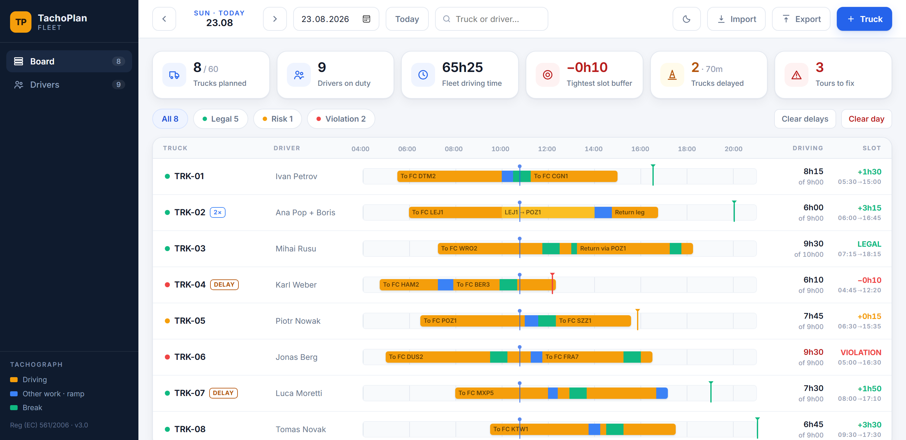

# TachoPlan Fleet

A planning board for EU road transport, built around **Regulation (EC) 561/2006** — driving times, breaks and rest periods. Plan up to 60 trucks a day on one shared timeline, and catch violations *before* they happen on the road.

Built by a professional truck driver moving into transport planning: the tool models the rules to the minute, the way a tachograph does — not approximately.



## What it does

**Per tour (daily rules)**
- 45-minute break inserted automatically after each 4h30 of accumulated driving (Art. 7); the **15 + 30 split** is recognised — after a 15-minute first part only the missing 30 is added
- Daily driving 9h / 10h extended (Art. 6); shift-span checks 13h / 15h tied to the daily rest that follows
- Slot feasibility: arrival against the booked Amazon slot with a live buffer; under 20 minutes flags RISK
- Live disruption per truck: **traffic delay** counts as driving — it burns hours and can force another break — while a **ramp queue** counts as other work and only shifts arrival
- **Multi-manning**: per-leg driver assignment, 45 minutes as passenger in a moving vehicle counted as a break, 21h crew span inside the 30h window

**Per driver (weekly rules)**
- Fixed weeks Mon 00:00 – Sun 24:00, exactly as the regulation defines them
- Weekly 56h and two-week 90h driving caps; at most two extended (>9h) days per week
- Daily rest between duty days: 11h regular / 9h reduced, at most three reduced between weekly rests (Art. 8)
- Weekly rest: regular 45h / reduced 24h, with **compensation tracked** — how much is owed and the date it is due; two consecutive reduced weekly rests flagged (Art. 8(6)); overdue weekly rest after six 24h periods
- A driver's weekly breach is raised on the board row of the truck they are on, so history cannot quietly sink tomorrow's tour

**Working the board**
- One time scale for the whole day: every truck drawn on the same clock with an hour ruler, slot pins and a now marker, so tours are comparable at a glance
- KPI tiles (trucks, drivers, fleet driving time, tightest buffer, delays, tours to fix), status filters, search by truck or driver
- Day-by-day boards with date navigation and one-click copy of the previous day
- CSV import — a file or a straight paste out of Excel — and Excel-friendly CSV export
- Light and dark themes; installable as a PWA and runs offline

## Run it

No build, no dependencies.

- **Local:** open `index.html` in any browser. Data is stored in that browser (localStorage).
- **Deploy:** drop the whole folder onto [Netlify](https://app.netlify.com/drop) or enable GitHub Pages. Any static host works — keep `fonts/` next to `index.html`.

### URL parameters

| Parameter | Effect |
|---|---|
| `?demo` | loads a sample fleet with a week of history; nothing is saved |
| `&view=drivers` | opens the driver analytics view |
| `&open=TRK-04` | expands one truck's editor |
| `&q=karl` | filters the board by truck or driver |
| `&theme=dark` | forces a theme for this visit |

Example: `index.html?demo&open=TRK-04&q=karl`

## CSV format

```
truck;driver;driver2;crew;date;start;slot;extended;segments
TRK-01;Ivan Petrov;;;2026-08-10;05:30;16:30;;drive:4h30:To FC DTM2|other:30:Trailer swap|drive:3h45:To FC CGN1
TRK-02;Ana Pop;Boris Ionescu;1;;06:00;20:00;;drive:4h00:Leg A|drive2:4h00:Leg B (D2)|other:45:Swap
```

- Columns in any order, case-insensitive; delimiter detected automatically (`;` `,` or TAB, so pasting from Excel works)
- `segments` = `type:minutes:label|…` where type is `drive`, `drive2` (crew, second driver), `other`/`work`, `break`; minutes accept `300`, `5h00`, `5:30`
- An empty `date` means the day currently open on the board

## Honest limits

A planning aid, not a legal record. Ferry and train derogations, out-of-scope driving and Art. 12 exceptional circumstances are not modelled; weekly figures only count the days present in the planner. The final authority is always the tachograph.

## Tech

Vanilla JavaScript, no dependencies, no server — the fleet's data never leaves the device. Inter is bundled locally (variable woff2, one `@font-face` per unicode subset) so the board renders identically offline. Design tokens keep two colour systems apart: blue is interface chrome, while amber/green/red carry tachograph meaning.
